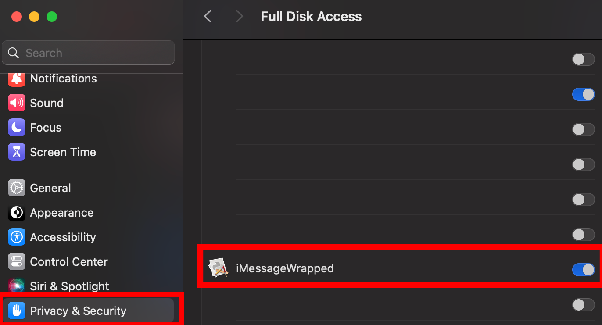
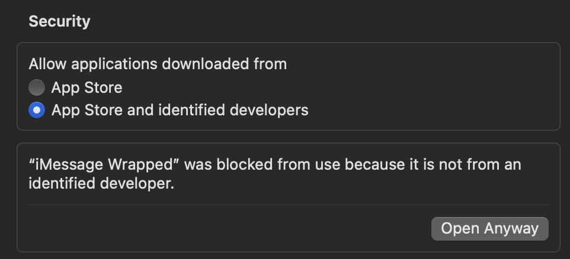

# iMessage Wrapped Setup Guide

Welcome to **iMessage Wrapped**! This guide provides instructions on how to set up and run the application.

## Description

*iMessage Wrapped* is a delightful utility application designed to offer insights and analytics about your iMessage usage over the past year. Much like Spotify Wrapped provides a summary of your music listening habits, iMessage Wrapped compiles and presents a comprehensive overview of your most frequent contacts, popular emojis, message frequency, and other intriguing statistics derived from your iMessage conversations throughout the year. Gain fascinating insights into your communication patterns and relive memorable moments as you explore your personalized iMessage journey.

## Installation

1. [Download the application installer (DMG file)](https://drive.google.com/file/d/1ZhUYdRhbO5d55N-7Wn_hq3x91SBBliaE/view?usp=sharing)
2. Open the downloaded DMG file and drag the app to the Applications folder.
3. Grant the app **Full Disk Access**:
   - Go to **System Preferences** > **Security & Privacy** > **Privacy**.
   - Select **Full Disk Access** from the list.
   - Click the lock icon to make changes.
   - Click the **+** button, navigate to the application, and add it to the list.
   - 
4. Secruity Access
   - Due to MacOS constraints, you may also need to provide security access
   - If an image like this pops up:
     
   - You may need to right click and "Open" or Allow Security Access via System Settings as show:
     

## Usage

To run the application, follow these steps:

1. Open the **Applications** folder.
2. Double-click on **iMessage Wrapped** to launch it.

## Acknowledgements

Created by *Ritij Jutur*
