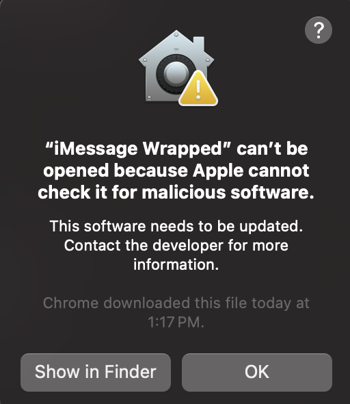

# iMessage Wrapped Setup Guide

**As of right now, this application only works with MacOS devices with Silicon Chips (M1, M2, M3). It doesn't work with Intel Chips.**

Welcome to **iMessage Wrapped**! This guide provides instructions on how to set up and run the application.

## Description

*iMessage Wrapped* is a delightful utility application designed to offer insights and analytics about your iMessage usage over the past year. Much like Spotify Wrapped provides a summary of your music listening habits, iMessage Wrapped compiles and presents a comprehensive overview of your most frequent contacts, popular emojis, message frequency, and other intriguing statistics derived from your iMessage conversations throughout the year. Gain fascinating insights into your communication patterns and relive memorable moments as you explore your personalized iMessage journey.

The idea of creating a yearly wrap-up for iMessage usage brings a fresh and exciting twist to messaging apps. By offering personalized insights into communication habits, the app turns everyday data into something fun and engaging.

On a social level, iMessage Wrapped helps users relive their favorite moments, reminding them of the connections they've made throughout the year. Highlighting frequent contacts and popular emojis adds a personal touch, making users feel closer to their friends and family. This engaging approach not only sparks curiosity and enjoyment but also encourages users to share their insights with others, fostering a sense of community and connection.

## Installation

1. [Download the application installer (DMG file)](https://drive.google.com/file/d/1VaI1dc6_OKJSrgbNHQzqWI8WUKrvVLkN/view?usp=sharing)
2. Open the downloaded DMG file and drag the app to the Applications folder.
3. Grant the app **Full Disk Access**:
   - Go to **System Preferences** > **Security & Privacy** > **Privacy**.
   - Select **Full Disk Access** from the list.
   - Click the lock icon to make changes.
   - Click the **+** button, navigate to the application, and add it to the list.
   - 
4. If you encounter a security access prompt while trying to open the application, follow these steps:
   - If you see a prompt like the following:
   - 
   - **Right-click** on the application icon. Select **"Open"** from the context menu.
   - If the application still doesn’t open, you might need to grant access via System Settings:
   - Go to **System Preferences** on your Mac. Select **"Security & Privacy"**.
   - 

## Usage

To run the application, follow these steps:

1. Open the **Applications** folder.
2. Double-click on **iMessage Wrapped** to launch it.

## Acknowledgements

Created by *Ritij Jutur*
